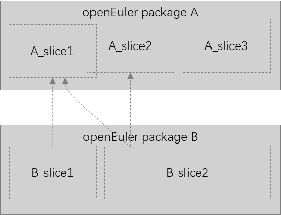

# splitter

#### 介绍
在openEuler官方软件包的基础上，对软件包中的文件经行切分处理，提取程序运行所需的最小文件集合。通过对软件包更小粒度的切分，更精细的梳理软件包切片的依赖关系，
从而进一步减小无用切片依赖的引入， 整体上减少应用的体积，目前实践于制作distroless容器镜像的原材料。



上述软件包依赖关系中，软件包A和B被切分为多个切片。在软件包的依赖中，软件包B依赖于软件包A。但实际上，软件包A中可能存在软件包B不需要的文件A_slice3，
去掉后并不会影响程序的功能。

#### 软件架构
软件架构说明


#### 安装教程

1. 安装系统依赖
```
dnf install python3-dnf git python3-pip cpio
```

2. 克隆源码仓库
```
git clone https://gitee.com/openeuler/splitter.git
```

3. 安装软件依赖
```
pip install -r requirements.txt
```

#### 使用说明
splitter使用cut命令行对软件包切分提取切片内容，查看命令行工具说明
```
splitter cut --help

Usage: splitter cut [OPTIONS] [PARTS]...

  Split parts from openEuler packages.

Options:
  -r, --release TEXT  This decides which openEuler release you will use, such
                      as `openEuler-24.03-LTS-SP1`.  [required]
  -a, --arch TEXT     The architecture you need.  [required]
  -o, --output TEXT   The path to output generated parts.  [required]
  --help              Show this message and exit.

```

示例：
splitter工具依赖切片仓库发布的软件包切片文件，切片时指定openEuler的版本和需要的切片内容。
```angular2html
splitter cut -r 24.03-LTS -a x86_64 -o /path/to/output python3.11_standard python3.11_utils
```
上述命令行会下载24.03-LTS版本发布的切片中提取python3.11_standard和python3.11_utils切片中的内容，并且会递归的提取它们依赖的切片内容。
最终的rootfs的文件系统会在`/path/to/output`目录中。

#### 参与贡献

1.  Fork 本仓库
2.  新建 Feat_xxx 分支
3.  提交代码
4.  新建 Pull Request


#### 特技

1.  使用 Readme\_XXX.md 来支持不同的语言，例如 Readme\_en.md, Readme\_zh.md
2.  Gitee 官方博客 [blog.gitee.com](https://blog.gitee.com)
3.  你可以 [https://gitee.com/explore](https://gitee.com/explore) 这个地址来了解 Gitee 上的优秀开源项目
4.  [GVP](https://gitee.com/gvp) 全称是 Gitee 最有价值开源项目，是综合评定出的优秀开源项目
5.  Gitee 官方提供的使用手册 [https://gitee.com/help](https://gitee.com/help)
6.  Gitee 封面人物是一档用来展示 Gitee 会员风采的栏目 [https://gitee.com/gitee-stars/](https://gitee.com/gitee-stars/)
